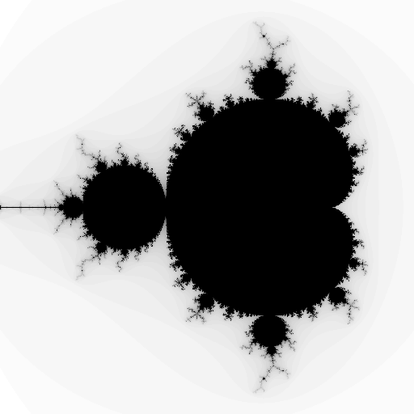

Basic greyscale Mandelbrot set visualiser. 

Instructions: Change max_iterations to change accuracy. Change variables w, h to change image size. Compile and run main.cpp, with stb_image_write.h for image output. Open mandelbrot.bmp for output image.

Output:

